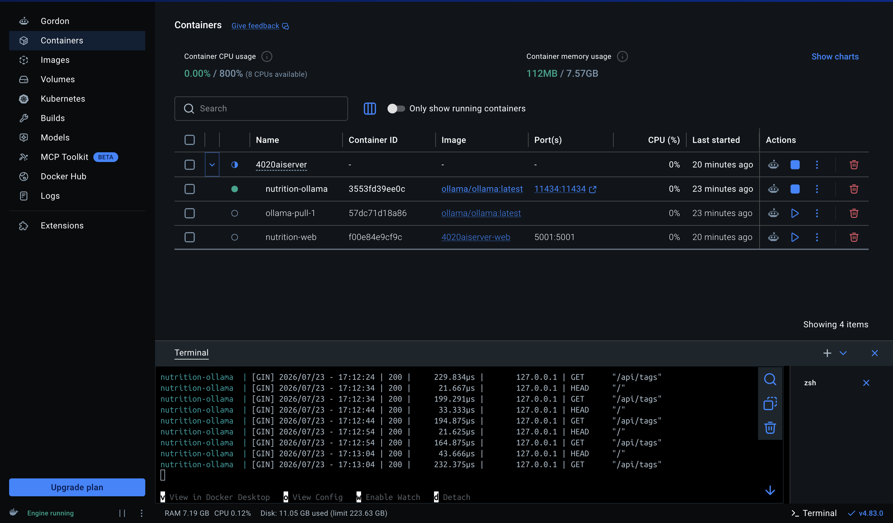

Setup
---

1. If you do not already have docker installed:

Method 1:
```
https://www.docker.com/products/docker-desktop/
```

Method 2: Homebrew *Optional*

```
https://formulae.brew.sh/cask/docker-desktop
```
Or

```zsh
brew install --cask docker-desktop
```
---

### More info:
Install, Setup and Configure Docker:

```
https://docs.docker.com/manuals/
```
Check Your Docker Installation

```
https://www.docker.com/blog/how-to-check-docker-version/
```
---
2. Docker Compose:

Change the directory to the project, and then run:

```
docker compose up --build
```
Or to run it detached in the background.

```zsh
docker compose up -d --build
```
The `-d` flag stands for detached mode


---

After completing the steps above, this is what you should see.



Once running, the Containers tab shows nutrition-ollama and nutrition-web grouped together, and you can view logs or stop/restart from there without touching the terminal again.

---

To stop everything: 

```zsh
docker compose down
```
Add `-v` only if you want to wipe the pulled model too.
You usually don't, since re-pulling takes time.

---

### References

* [Ollama](https://ollama.com/)
* [Alternative Install Guide](https://namrata23.medium.com/run-llms-locally-or-in-docker-with-ollama-ollama-webui-379029060324)