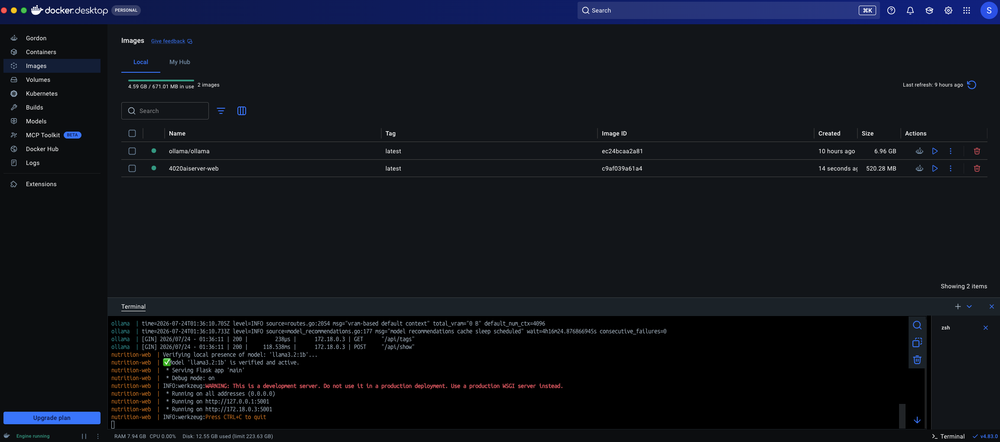
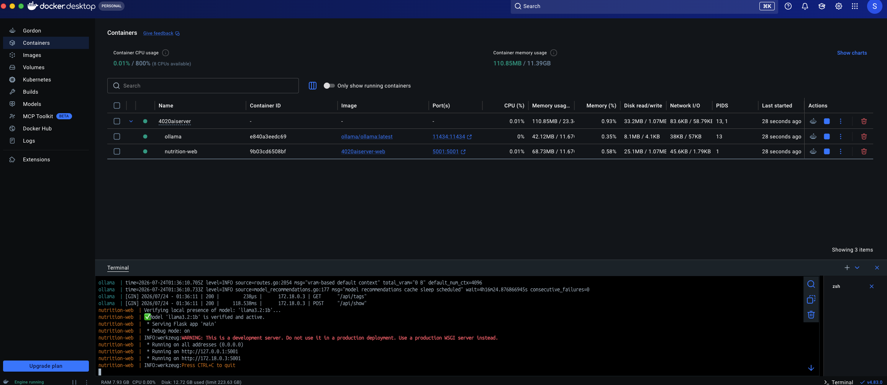

# <p align="center">ITEC 4020 Client Server AI Project</p>

### [Dominic Gopalakrishnan](https://github.com/TheRiftGuardian) 220124392
### Sebastian Dorata 219015999
<sub>July 27, 2026</sub></p>

## Tech Stack

| Category            | Technology                                                                                               | Purpose                                          |
|---------------------|----------------------------------------------------------------------------------------------------------|--------------------------------------------------|
| **Backend**         | Python 3.12                                                                                              | Core language                                    |
|                     | Flask                                                                                                    | Web framework                                    |
|                     | Flask-SQLAlchemy / SQLAlchemy                                                                            | ORM / database layer                             |
|                     | Flask-WTF / WTForms                                                                                      | Form handling and validation                     |
|                     | Bootstrap-Flask                                                                                          | Bootstrap 5 integration for Jinja templates      |
| **Database**        | SQLite                                                                                                   | Stores food nutrition data and aliases           |
| **AI / LLM**        | Ollama                                                                                                   | Local LLM runtime for meal plan generation       |
|                     | Llama 3.2 (1B)                                                                                           | Model used to generate meal plans                |
| **Frontend**        | HTML5 / Jinja2                                                                                           | Templating                                       |
|                     | Bootstrap 5                                                                                              | UI styling and layout                            |
|                     | JavaScript (vanilla)                                                                                     | Nav scroll behavior, interactivity               |
|                     | Chart.js + chartjs-plugin-datalabels                                                                     | Macro distribution pie charts                    |
| **Data Processing** | Pandas                                                                                                   | Dataset import/cleaning                          |
|                     | Requests                                                                                                 | HTTP calls to the Ollama API                     |
| **Infrastructure**  | Docker / Docker Compose                                                                                  | Containerized deployment (self-contained method) |
| **Dataset**         | USDA MyFoodData ([Kaggle](https://www.kaggle.com/datasets/waltonj/usda-myfooddata-nutrition-facts-2020)) | Source nutrition data                            |


---
 
## Running the app
 
There are two ways to run this project. Pick whichever fits what you're trying to do.
 
|                     | **[Method 1](#method-1)**                             | **[Method 2](#method-2)**                                                         |
|---------------------|-------------------------------------------------------|-----------------------------------------------------------------------------------|
| Best for            | Sharing with others, quickest path to "it just works" | Local development, fastest inference (uses your machine's GPU/Metal acceleration) |
| Requires installing | Docker Desktop only                                   | Python, and Ollama natively                                                       |
| Speed               | Slower (CPU-only inside the container)                | Faster (native GPU/Metal acceleration)                                            |
| Setup effort        | Low                                                   | Medium                                                                            |
 
---
 
<a id="method-1"></a>
### Method 1: Self-contained Docker (recommended for most people)
 
Everything — the web app, Ollama, and the AI model — runs inside Docker. You do **not**
need Python or Ollama installed on your machine at all.
 
**1. Install Docker Desktop**
 
- **Windows:** https://www.docker.com/products/docker-desktop/
- **macOS:** https://www.docker.com/products/docker-desktop/ or 
```
brew install --cask docker-desktop
```

- **Linux:** https://docs.docker.com/desktop/setup/install/linux/ (or install Docker Engine + Docker Compose directly: https://docs.docker.com/engine/install/)
  
**2. Clone the repo**
 
```bash
git clone https://github.com/SebastianDorata/4020AIServer.git
cd 4020AIServer
```
 
**3. Run it (Choose your hardware path)**

*   **For standard/CPU mode (Mac M-Series, older PCs, or quick setup):**
    ```bash
    docker compose up --build
    ```
*   **For NVIDIA GPU hardware acceleration (Linux / Windows WSL2 only):**
    ```bash
    docker compose -f docker-compose.gpu.yml up --build
    ```
 
First run will take a few minutes: it builds the app image, downloads the Ollama
container, and pulls the AI model (~1.3GB). This is normal and only happens once —
subsequent runs are fast.



 
**4. Open the app**
 
Go to [http://localhost:5001](http://localhost:5001) in your browser.
 
**5. Stop it**
 
Press `Ctrl+C` in the terminal, or run:
 
```zsh
docker compose down
```
To delete the downloaded model

```zsh
docker compose down -v
```
To nuke the image(s):

```zsh
docker compose down -v --rmi all
```
---
 
<a id="method-2"></a>
### Method 2: Bare metal + native Ollama
 
Runs Python and Ollama directly on your machine instead of inside containers. Faster
inference (uses your GPU/Metal), but more setup steps and OS-specific instructions.
 
### <u>Windows</u>
 
**1. Install Python 3.12+**
Download from https://www.python.org/downloads/ (check "Add python.exe to PATH" during install).
 
**2. Install Ollama**
Download and run the installer from https://ollama.com/download/windows
 
**3. Pull the model**
```powershell
ollama pull llama3.2:1b
```
 
**4. Verify Ollama is running**
```powershell
curl http://localhost:11434/api/tags
```
You should see `llama3.2:1b` in the response.
 
**5. Set up the project**
```powershell
git clone https://github.com/SebastianDorata/4020AIServer.git
cd 4020AIServer
python -m venv .venv
.venv\Scripts\activate
pip install -r requirements.txt
```
 
**6. Run it**
```powershell
python main.py
```
 
**7. Open the app**
Go to [http://localhost:5001](http://localhost:5001) in your browser.
 
---
 
### <u>MacOS</u>
 
**1. Install Homebrew** (if you don't already have it)
```zsh
/bin/bash -c "$(curl -fsSL https://raw.githubusercontent.com/Homebrew/install/HEAD/install.sh)"
```
 
**2. Install Python and Ollama**
```zsh
brew install python@3.12 ollama
brew services start ollama
```
`brew services start ollama` runs Ollama as a background service that starts
automatically on login, so you don't need to start it manually each time.
 
**3. Pull the model**
```zsh
ollama pull llama3.2:1b
```
 
**4. Verify Ollama is running**
```zsh
curl http://localhost:11434/api/tags
```
You should see `llama3.2:1b` in the response.
 
**5. Set up the project**
```zsh
git clone https://github.com/SebastianDorata/4020AIServer.git
cd 4020AIServer
python3 -m venv .venv
source .venv/bin/activate
pip install -r requirements.txt
```
 
**6. Run it**
```zsh
python main.py
```
 
**7. Open the app**
Go to [http://localhost:5001](http://localhost:5001) in your browser.
 
---
 
### <u>Linux</u>
 
**1. Install Python 3.12+**
```bash
sudo apt update && sudo apt install python3 python3-venv python3-pip   # Debian/Ubuntu
# or your distro's equivalent package manager
```
 
**2. Install Ollama**
```bash
curl -fsSL https://ollama.com/install.sh | sh
```
 
**3. Start Ollama and pull the model**
```bash
ollama serve &          # or: sudo systemctl start ollama, if installed as a service
ollama pull llama3.2:1b
```
 
**4. Verify Ollama is running**
```bash
curl http://localhost:11434/api/tags
```
You should see `llama3.2:1b` in the response.
 
**5. Set up the project**
```bash
git clone https://github.com/SebastianDorata/4020AIServer.git
cd 4020AIServer
python3 -m venv .venv
source .venv/bin/activate
pip install -r requirements.txt
```
 
**6. Run it**
```bash
python3 main.py
```
 
**7. Open the app**
Go to [http://localhost:5001](http://localhost:5001) in your browser.
 
---
 
### Troubleshooting
 
| Symptom                                                     | Cause                                                                   | Fix                                                                                                                                                            |
|-------------------------------------------------------------|-------------------------------------------------------------------------|----------------------------------------------------------------------------------------------------------------------------------------------------------------|
| `Connection refused` on port 11434                          | Ollama isn't running                                                    | Start it: `ollama serve` (Linux) or `brew services start ollama` (macOS) or check it's running in your system tray (Windows)                                   |
| `ImportError: cannot import name 'Bootstrap5'`              | Wrong Bootstrap package installed                                       | Make sure `requirements.txt` lists `Bootstrap-Flask`, not `flask-bootstrap`, then reinstall: `pip install -r requirements.txt`                                 |
| Meal plan looks empty or way under the calorie target       | The AI suggested a food name not in the database                        | Check the app logs for `Meal plan generated: ... items per meal` — low numbers mean foods are being skipped. Add matching entries to the `food_aliases` table. |
| Docker build fails / can't find `Dockerfile`                | Not running the command from the project root                           | `cd` into the folder containing `docker-compose.yml` first                                                                                                     |
| Container logs look healthy but `localhost:5001` won't load | Flask is bound to `127.0.0.1` instead of `0.0.0.0` inside the container | Confirm `main.py`'s `app.run()` includes `host="0.0.0.0"` when RUNNING_IN_DOCKER is set                                                                        |
 
---
 
### References
 
* [Ollama](https://ollama.com/)
* [Docker Desktop](https://www.docker.com/products/docker-desktop/)

* AI usage for debugging and idea generation .